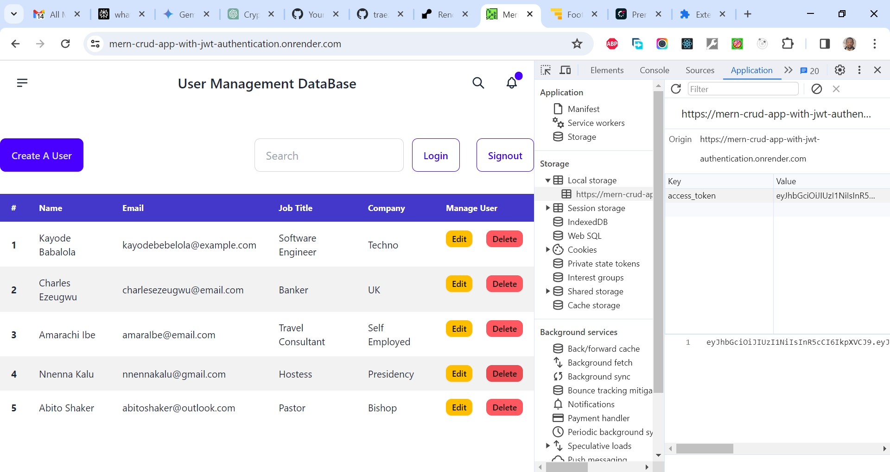

# Brad Traversy's MERN Crash Course - JWT Authentication - Redux Toolkit Tutorial

This is a solution to the [Brad Traversy's MERN Crash Course - JWT Authentication - Redux Toolkit Tutorial](https://www.youtube.com/watch?v=R4AhvYORZRY&t=136s). I'm testing my hand creating very simple (follow along) projects for now to get familiar with the matter. 

## Table of contents

- [Overview](#overview)
  - [The challenge](#the-challenge)
  - [Screenshot](#screenshot)
  - [Links](#links)
  - [My process](#my-process)
  - [Built with](#built-with)
  - [What I learned](#what-i-learned)
  - [Continued development](#continued-development)
  - [Useful resources](#useful-resources)
  - [Author](#author)
  - [Acknowledgments](#acknowledgments)

## Overview

### The Challenge/User Stories

In this project, we will create a MERN stack app with a React SPA frontend. The main focus is authentication, but you will learn how to create a full-featured API, manage state with Redux Toolkit, and more.

### Screenshot

### Links

- Solution URL: [https://github.com/traez/mern-authentication-redux-course](https://github.com/traez/mern-authentication-redux-course)
- Live Site URL: [https://mern-authentication-redux-course.onrender.com/](https://mern-authentication-redux-course.onrender.com/)

## My process

### Built with

- Semantic HTML5 markup 
- CSS custom properties 
- Flexbox 
- CSS Grid 
- Mobile-first workflow 
- [React](https://reactjs.org/) - JS library 
- [Next.js](https://nextjs.org/) - React framework (No)
- Tailwind CSS  
- Typescript (No)
- Nodejs
- Expressjs
- MongoDB

### What I learned

- When running "npm init" with an existing README file, the package.json description was automatically filled from the README.      
- If there's an existing ".js" file in the folder upon creation, the node "scripts" command in package.json is also filled in using the ".js file's" name.   
- On the client side (React components), "react-cookie" is used to manage cookies, while on the server side (with Express.js), "cookie-parser" is used to parse and handle cookies sent by the client.     
- "bcrypt" is a bcrypt library for Node.js, whereas "bcryptjs" is an optimized bcrypt in plain JavaScript with zero dependencies.  
- The "express-async-handler" middleware is used to replace native async/await, providing extra efficiency.  
- For route chaining with different methods for a single route, the convention is as follows:
router.route("/profile").get(getUserProfile).put(updateUserProfile);  
- Learned that in In VSCode ThunderClient extension, batch-related API endpoint queries are grouped together for ease of use.  
- The use of app.use(express.urlencoded({ extended: true })); is for HTML forms that submit data to the server.  
- To allow the Express server to properly retrieve and process cookies, you may need to manually set the 'Cookie' header in your ThunderClient request to include the 'jwt' cookie. Example: Cookie: jwt=your_actual_jwt_token. Use the cookie-parser middleware to parse incoming cookies, accessing the 'jwt' cookie in your route using req.cookies.jwt. Example: const token = req.cookies.jwt;.   
- An introduction to Redux, Redux Toolkit, and React Redux is provided, emphasizing the need for in-depth study.  
- In Vite, instead of setting the API route as an environmental variable, it is set under the proxy in vite.config.js (similar to package.json proxy in Create React App).  
- The command npm install concurrently is used in Node.js projects to run multiple commands concurrently, useful for tasks like running both the frontend and backend servers simultaneously during development.  
- For CSS work, the following dependencies are useful when installed: npm i react-bootstrap react-icons bootstrap. 
- An introduction to "react-toastify," an app providing an easy way to display toast notifications in web applications. Toast notifications are non-intrusive, temporary messages that inform users about the status of an action or provide feedback.
- Regarding the static file serving order (when serving the frontend as static files from the backend): Ensure that the code for serving static files is placed after the code for handling API routes in your backend server. Otherwise, you may encounter this error: "Uncaught (in promise) SyntaxError: Unexpected token '<', "<!//doctype "... is not valid JSON."  

### Continued development

- Keep coding everyday and increasing competency!

### Useful resources

Stackoverflow  
YouTube  
Google  
ChatGPT

## Author

- Website - [Trae Zeeofor](https://github.com/traez)
- Twitter - [@trae_z](https://twitter.com/trae_z)

## Acknowledgments
 
-Jehovah that keeps breath in my longs 